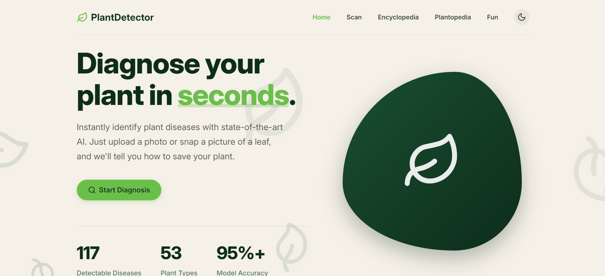

# 🌿 Plant Disease Detector



[](https://reactjs.org/)
[](https://fastapi.tiangolo.com/)
[](https://www.python.org/)
[](https://www.tensorflow.org/)

An AI-powered application designed to instantly diagnose **117+ different plant diseases** from uploaded photos or real-time camera captures. Built with a stunning, modern dark-mode interface featuring glassmorphism and smooth animations.

---

## ✨ Key Features

- **🚀 Real-time Diagnosis**: Get instant results for **117+** common plant disease classes.
- **📸 Multi-Input Support**: Upload existing leaf photos or capture them directly using your device's camera.
- **🌳 Plantopedia**: A comprehensive encyclopedia of plant diseases with detailed information on symptoms and treatments.
- **🎨 Premium UI/UX**: A beautiful, responsive interface with:
  - Dark-green "Nature" aesthetic
  - Glassmorphic cards and buttons
  - Smooth micro-animations and transitions
  - Mobile-friendly responsive design
- **⚡ Fast Backend**: Powered by FastAPI for high-performance inference.

---

## 🛠️ Technology Stack

| Layer | Technologies |
| :--- | :--- |
| **Frontend** | React, TypeScript, Vite, Vanilla CSS (Custom Design System) |
| **Backend** | FastAPI, Python, Uvicorn |
| **Machine Learning** | TensorFlow/Keras, MobileNetV2, NumPy, OpenCV |
| **Data Source** | [PlantVillage Dataset](https://www.kaggle.com/emmareed/plantvillage-dataset) |

---

## 🚀 Getting Started

### Prerequisites

- **Python 3.9+**
- **Node.js 18+**
- **Git**

### 1. Clone the Repository
```bash
git clone https://github.com/SHAIKANASBASHA-55/PlantDiseaseDetector.git
cd PlantDiseaseDetector
```

### 2. Backend Setup
```bash
cd backend
# Run the automated setup script
./start.bat
```
*The script will automatically create a virtual environment, install dependencies from `requirements.txt`, and start the server on `http://localhost:8000`.*

### 3. Frontend Setup
```bash
cd frontend
npm install
npm run dev
```
*The app will be available at `http://localhost:5173`.*

---

## 📂 Project Structure

```text
PlantDiseaseDetector/
├── backend/
│   ├── main.py              # FastAPI entry point
│   ├── disease_info.py      # Detailed disease metadata
│   ├── requirements.txt     # Python dependencies
│   ├── start.bat            # Automated backend starter
│   └── model/               # ML logic and trained scripts
├── frontend/
│   ├── src/
│   │   ├── pages/           # Home, Scan, Encyclopedia, Results
│   │   ├── components/      # Reusable UI elements
│   │   └── App.tsx          # Main routing logic
│   ├── public/              # Static assets and icons
│   └── vite.config.ts      # Vite configuration
└── README.md                # Project documentation
```

---

## 📋 Supported Diseases
The model is trained on **117+ classes** across multiple crops, including:
- **🍎 Apple/Cherry/Peach**: Scab, Black rot, Rust, Powdery mildew, Bacterial spot
- **🍅 Tomato/Potato**: Early & Late blight, Leaf mold, Septoria, Target spot, Bacterial spot, Mosaic virus
- **🌽 Corn**: Gray leaf spot, Common rust, Northern blight
- **🍇 Grape**: Black rot, Esca (Black Measles), Leaf blight
- **🍊 Citrus**: Huanglongbing (Citrus greening)
- **🌶️ Bell Pepper**: Bacterial spot
- **🍌 Banana**: Sigatoka
- **🍚 Rice/Wheat**: Brown spot, Leaf rust
- **☕ Coffee**: Rust
- **🥭 Mango**: Anthracnose
- **🧪 Others**: Cassava, Rose, Sugarcane, Cucumber, Watermelon
- *And many more healthy conditions for each crop.*

---

## 🤝 Contributing
Contributions are welcome! Feel free to open an issue or submit a pull request.

## 📄 License
This project is licensed under the MIT License - see the LICENSE file for details.

---
*Created by [SHAIKANASBASHA](https://github.com/SHAIKANASBASHA-55)*
